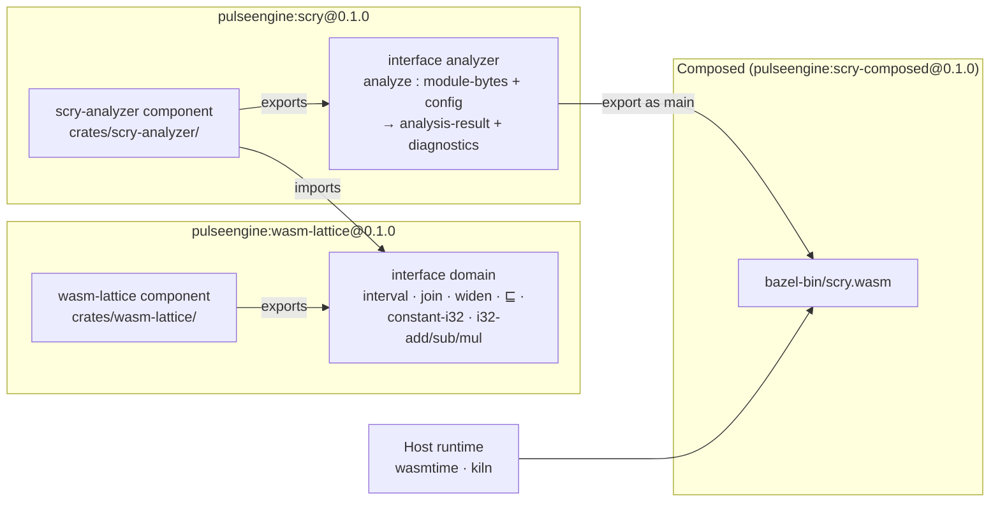
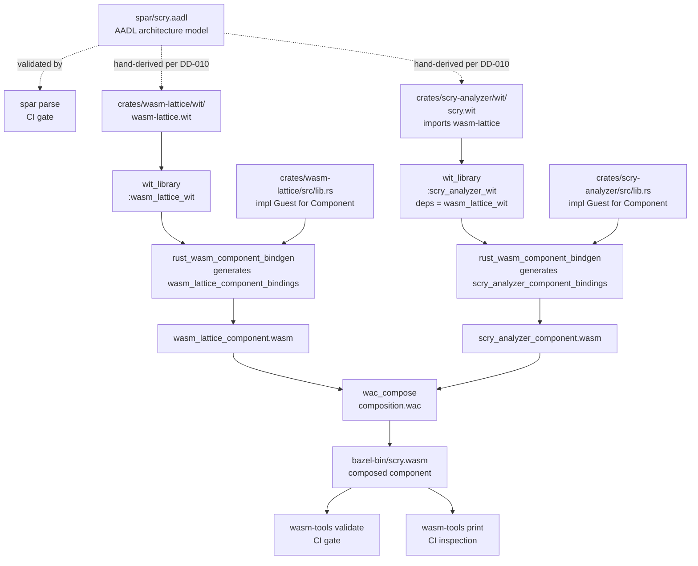
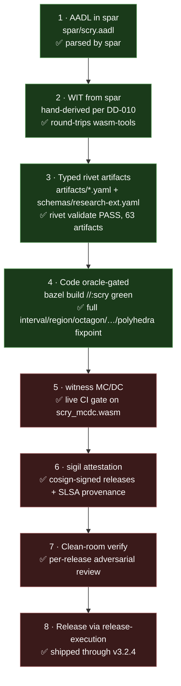
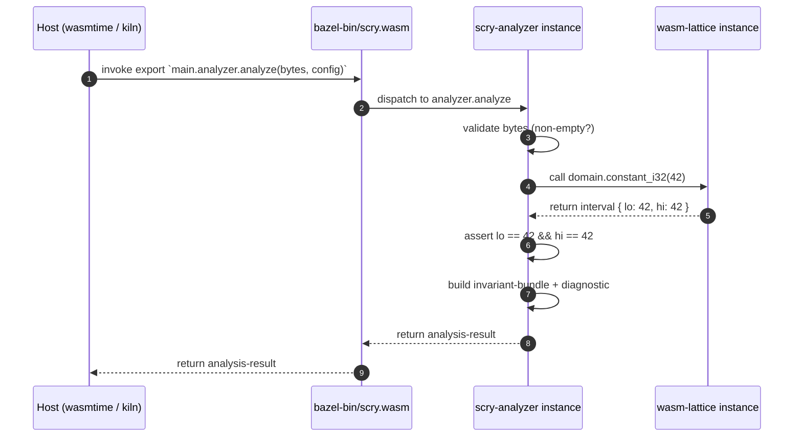
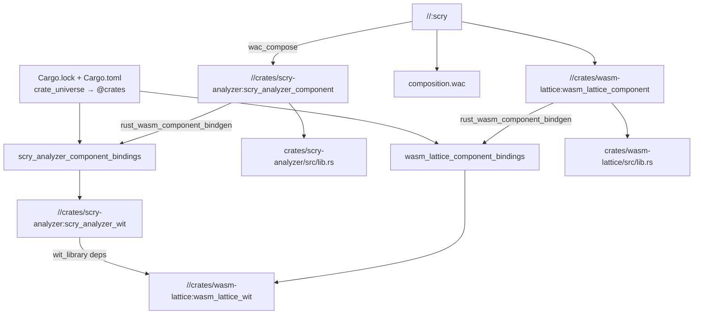

# scry v0.1 — architecture and build pipeline

scry is a sound abstract-interpretation pass for WebAssembly that ships
**as a WebAssembly Component Model component** built with
`rules_wasm_component` (see [[DD-008]] for the dogfood rationale,
[[DD-009]] for the Bazel-first build choice). This document
explains what's in v0.1, how the pieces fit together, and what the
build and verification pipeline actually does.

For the *why* (the DO-333 gap, the literature pass, the safety case)
see the project [README](../README.md) and [`docs/roadmap.md`](roadmap.md).
This doc is the *how*.

## TL;DR

- Two Rust crates → two `wasm32-wasip2` Component Model components,
  composed by `wac` into one distributable `bazel-bin/scry.wasm`.
- AADL model at `spar/scry.aadl` is the architecture source of truth;
  per-crate WIT files (`crates/*/wit/*.wit`) are hand-derived from it
  (see [[DD-010]]).
- Toolchain: Bazel + `rules_wasm_component v1.0.0` +
  `rules_rust` + `crate_universe`. Rust edition **2024**.
- The v0.1 scaffold exercises the cross-component WIT import
  end-to-end at runtime (the analyzer calls
  `pulseengine:wasm-lattice/domain.constant_i32(42)` and reports the
  result in a diagnostic) — that's the dogfood gate. Real interval-
  domain fixpoint logic lands with [[FEAT-001]] acceptance criterion
  #1 in a follow-on PR.

## 1. Two-component architecture

scry decomposes into a **lattice library component** and an
**analyzer component**. The analyzer depends on the lattice via a WIT
cross-component import; `wac compose` resolves the wiring at build
time and produces a single composed `.wasm` that exports the
analyzer's `analyzer.analyze` function as `main`.



The full WIT is in `crates/wasm-lattice/wit/wasm-lattice.wit` and
`crates/scry-analyzer/wit/scry.wit`. Both round-trip cleanly through
`wasm-tools component wit`; cross-package import resolution happens
in Bazel's `wit_library` rule via its `deps` attribute, not on the
filesystem.

### Why two components?

Per [[DD-004]] the lattice should be reusable across PulseEngine
tools (witness for coverage-gap prediction, synth for codegen
invariant generation). Per [[DD-008]] scry's own build should
exercise the Wasm Component Model end-to-end as a dogfood. Splitting
into two components from day one delivers both: the lattice is a
reusable component, and the analyzer's import of it gives WAC
composition something non-trivial to actually compose.

For v0.1 a single fused component is enough; later versions may keep
the lattice as a separately-distributed component so external tools
can depend on it without pulling the analyzer.

## 2. The eight-layer build pipeline

What `bazel build //:scry` actually does, end to end. Every arrow
is a Bazel action; every box is an artifact in `bazel-out/`.



Walk-through:

1. **Architecture model** (`spar/scry.aadl`) — the human-readable AADL
   source. Models the two processes and their port connections. CI
   validates it with `spar parse` ([[DD-010]]).
2. **WIT** — one `.wit` per component, hand-derived from the AADL
   per [[DD-010]]. `crates/scry-analyzer/wit/scry.wit` declares
   `use pulseengine:wasm-lattice/domain@0.1.0.{interval}` and the
   analyzer's `scry` world imports the lattice's `domain` interface.
3. **`wit_library`** — Bazel rule that packages each `.wit` file
   into a `WitLibraryInfo` provider. The analyzer's `wit_library`
   has `deps = ["//crates/wasm-lattice:wasm_lattice_wit"]`, which
   wires the cross-package import via the Bazel-managed `deps/`
   directory layout (no filesystem symlink dance).
4. **`rust_wasm_component_bindgen`** — wraps `wit-bindgen` to
   generate the Rust bindings crate (`scry_analyzer_component_bindings`)
   plus the `cdylib` Rust target that compiles the user's `lib.rs`
   against those bindings.
5. **Per-component `.wasm`** — `wasm32-wasip2` Component Model
   modules; one per crate, sitting under `bazel-out/`.
6. **`wac_compose`** — reads `composition.wac`, instantiates each
   component, wires `analyzer.domain` to `lattice.domain`, exports
   the analyzer interface as `main`. Output is `bazel-bin/scry.wasm`.
7. **`wasm-tools validate`** — CI gate confirming the composed
   artifact is a valid Wasm Component Model module.
8. **`wasm-tools print`** — sanity inspection: shows the composed
   component's import list (wasi:io / wasi:cli) and the `main` export.

## 3. The composition contract — `composition.wac`

WAC syntax for the v0.1 composition:

```wac
package pulseengine:scry-composed@0.1.0;

let lattice = new pulseengine:wasm-lattice { ... };
let analyzer = new pulseengine:scry { domain: lattice.domain, ... };

export analyzer as main;
```

Three semantically loaded bits of syntax:

- `{ ... }` on `lattice` says "auto-wire all of this component's
  imports from the surrounding scope". The lattice has no WIT
  imports beyond what wit-bindgen's runtime injects (wasi:io,
  wasi:cli), so all of those flow through to the composed
  component's outer import list.
- `{ domain: lattice.domain, ... }` on `analyzer` says "wire the
  `domain` import to the lattice's `domain` export explicitly, and
  auto-wire everything else". Without the trailing `, ...` WAC
  fails to bind the WASI imports and the build fails with
  "missing instantiation argument `wasi:io/error@0.2.6`".
- `export analyzer as main` exposes the analyzer's `analyzer`
  interface as the composed component's primary export. The lattice
  is fused inside; consumers see only the analyzer's surface.

## 4. The eight-step PulseEngine verification loop

scry follows the
[pulseengine-feature-loop](https://github.com/pulseengine/pulseengine-claude/blob/main/skills/pulseengine-feature-loop/SKILL.md)
methodology. Where v0.1 sits in each step:



For v0.1 the green steps are the *structural* half of [[FEAT-001]]'s
acceptance criteria. Steps 5–8 light up as later features land
([[FEAT-004]] for sigil/rivet attestation chain, [[FEAT-010]] for
mechanized Rocq soundness, etc.).

## 5. Where the dogfood actually happens

scry's v0.1 dogfood claim per [[DD-008]] is: *scry itself passes
through the same Wasm Component Model chain it analyzes for other
consumers.* In concrete terms:

| Chain stage | Tool | scry's own use |
|---|---|---|
| WIT-typed components | `wit_library` + `rust_wasm_component_bindgen` | both scry crates |
| Composition | `wac_compose` | `composition.wac` wires lattice → analyzer |
| Component validation | `wasm-tools validate` | CI gate on `bazel-bin/scry.wasm` |
| Static fusion (later) | `meld_fuse` | v0.5+ once meld emits component-provenance per [[DD-002]] |
| Coverage measurement (later) | `witness` | v0.6+ once the analyzer has real branches |
| Optimization (later) | `loom` | v0.5+ once scry's invariants feed loom |
| Signed attestation (later) | `sigil` + cosign | v0.6 via `release.yml` |
| Audit traceability | `rivet` | already live: 63 artifacts |

The structural half of the chain is live today (CI builds + validates
the composed component). The verification half lights up as the
analyzer gets real branches to measure and real invariants to attest.

## 6. The cross-component runtime probe

> **Historical (v0.1 milestone).** This section describes the very first
> cross-component probe. As of v3.2.4 `analyze` runs the full
> interval/region/octagon/pentagon/float/known-bits/handle/segmentation/polyhedra
> fixpoint over a parsed Wasm module (see the roadmap and the 12 published
> `scry-sai-*` crates); the runtime wiring below is unchanged.

At the v0.1 milestone, `analyzer.analyze` did one non-trivial thing: it called
the lattice's `constant_i32(42)` and embedded the result in a diagnostic. That
call crosses the component boundary and exercises the entire WAC-composed
runtime wiring:



Steps 4–5 are the *load-bearing* part: if WAC failed to wire the
analyzer's `domain` import to the lattice's `domain` export, step 4
would trap or step 5 would return a wrong value. The diagnostic
message in the response reports whether the round-trip matched
expectations. That's the v0.1 gate.

## 7. The build dependency graph (for contributors)

When a contributor types `bazel build //:scry`, this is the target
graph Bazel resolves:



The cross-package WIT import shows up as the
`SCAWit → wit_library deps → WLWit` edge: that's how Bazel knows to
expose the lattice's WIT to the analyzer's `wit-bindgen` invocation
without filesystem hackery.

## 8. References

- Architecture decisions: [[DD-001]] (placement), [[DD-002]]
  (Component Model AI placement — closed), [[DD-003]] (WasmCert-Coq
  substrate), [[DD-004]] (reusable wasm-lattice), [[DD-005]] (v0
  domain set), [[DD-008]] (Wasm component dogfood), [[DD-009]]
  (Bazel + rules_wasm_component), [[DD-010]] (hand-derived WIT for
  v0.1).
- Requirements: [[REQ-001]] (sound AI pass), [[REQ-002]] (soundness
  vs operational semantics), [[REQ-006]] (reusable lattice library).
- Features delivered in v0.1: [[FEAT-001]].
- Features queued: [[FEAT-002]] through [[FEAT-011]] (see
  `docs/roadmap.md`).
- AADL source-of-truth: `spar/scry.aadl`.
- WIT: `crates/wasm-lattice/wit/wasm-lattice.wit`,
  `crates/scry-analyzer/wit/scry.wit`.
- Composition: `composition.wac`.
- Build rules: `MODULE.bazel`, `BUILD.bazel`,
  `crates/*/BUILD.bazel`.
