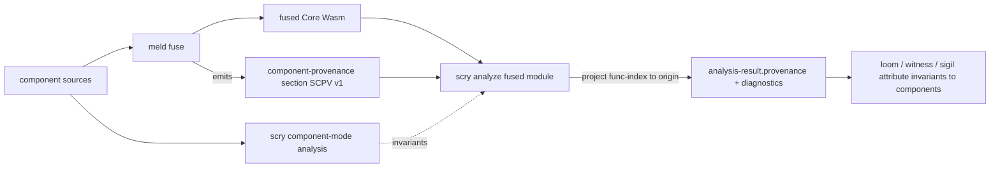

# scry component-provenance custom section (`SCPV` v1)

This document specifies the typed boundary between **meld** (the verification-fusion
tool) and **scry** for Wasm Component Model analysis: the `component-provenance`
custom section. It realizes [[FEAT-002]] (provenance slice) and is the concrete
form of the decision recorded in [[DD-002]].

- Section name (Wasm custom-section `name`): `component-provenance`
- Payload format id: `SCPV`, version `1`
- Producer: meld (emitter is a separate cross-repo concern — see below)
- Consumer: scry (`crates/scry-provenance` + the analyzer pre-pass)
- Reference implementation: `crates/scry-provenance/src/lib.rs`

## Why a custom section (and not re-analysis after fusion)

Per [[DD-002]], scry runs its Component-Model analysis on the *original component
sources* upstream of meld, where owned/borrowed handles, capability flow, and
host-call effects are still visible. meld then lowers the component graph to a
single fused Core Wasm module — at which point every downstream consumer (loom,
witness, sigil/rivet evidence) operates on fused-module function indices, not on
components.

To keep scry's Component-Model invariants attached to concrete fused-module
locations, meld emits a minimal **function-origin map** as a custom section:
fused-module function index → (originating component, originating function). scry
decodes it and *projects* its invariants onto the fused module. The boundary is
cleanly typed: meld owns Core Wasm fusion correctness (proven in Rocq); scry owns
Component-Model semantics. The section is the contract between them.

The investigation in [[DD-002]] established that meld already tracks per-function
origin tuples internally (`MergedFunction.origin`) and already emits a custom
section — so adding `component-provenance` is a small bolt-on, not an
architectural change. Per the chosen variant (b.1) the section is the **minimal**
function-origin map only: resource type names and handle shapes are *not* recorded
(scry derives those from the original component sources directly).

## Binary format

The section payload (the bytes after the Wasm custom-section name
`component-provenance`) is:

| offset | size   | field                                            |
| ------ | ------ | ------------------------------------------------ |
| 0      | 4      | magic = `b"SCPV"` (`0x53 0x43 0x50 0x56`)        |
| 4      | 1      | format-version = `1`                             |
| 5      | 4      | entry-count : `u32` little-endian                |
| 9      | 12·n   | entries (see below)                              |

Each entry is 12 bytes, all little-endian:

| offset | size | field              |
| ------ | ---- | ------------------ |
| 0      | 4    | `fused-func-index` : u32 |
| 4      | 4    | `component-id`     : u32 |
| 8      | 4    | `orig-func-index`  : u32 |

The decoder (`scry_provenance::decode`) is **strict**: it rejects a bad magic, an
unknown version, a payload shorter than the 9-byte header, and any body length
that does not exactly equal `12 × entry-count` (catching both truncation and
trailing garbage). A malformed section is a hard error, never a silent
partial-parse — scry reports it as a `diagnostic` and proceeds with `provenance =
none` so the core invariants stay sound.

## How scry consumes it

1. The analyzer's pre-pass walks the module with `wasmparser`. On a
   `CustomSection` whose `name()` equals `component-provenance`, it calls
   `scry_provenance::decode(reader.data())`.
2. After the abstract-interpretation phases, for every analyzed (fused) function
   the analyzer calls `scry_provenance::project(origins, fused_func_index)` to
   recover the component origin, and emits a projection diagnostic.
3. The decoded map is carried on `analysis-result.provenance`
   (`option<component-provenance>`) so loom / witness / sigil can attribute any
   fused-module invariant — keyed by `func-index` — back to its component source.

The `provenance` field is additive and optional in the v1 invariant contract
(`contracts/scry-invariants-v1.schema.json`): a module with no section (a single
un-fused component, or any plain Core Wasm input) yields `none`, and a v0.6-shaped
document with no `provenance` key still validates. See `docs/invariant-schema-v1.md`.

## scry ⇄ meld data flow

## Validation status (honest constraint)

The format is mechanically falsified on the native cargo path:

- `crates/scry-provenance` carries inline `encode`/`decode`/`project` unit tests
  (round-trip lossless, strict malformed rejection, projection hit/miss).
- `crates/scry-host-tests/tests/provenance.rs` re-exercises the same crate — the
  *same source* the wasm32-wasip2 analyzer links — and additionally round-trips
  the payload through a **real Wasm custom section** parsed back out with the exact
  `wasmparser` API the analyzer's pre-pass uses.

As with [[FEAT-008]], a live `analyze()` round-trip in the composed component is
not yet exercised in CI because `rules_wasm_component`'s `wac_compose` emits
root-level component imports that wasmtime 45 rejects (see the module doc in
`crates/scry-host-tests/tests/soundness.rs`). The v0.7.0 deliverable is the typed
boundary, its strict decoder, and the projection primitive — all falsified
natively. The **meld-side emitter** is tracked as a separate cross-repo concern,
mirroring the [[FEAT-008]] / meld#192 pattern; the handle-state lattice and
use-after-drop detection are a later FEAT-002 slice.
