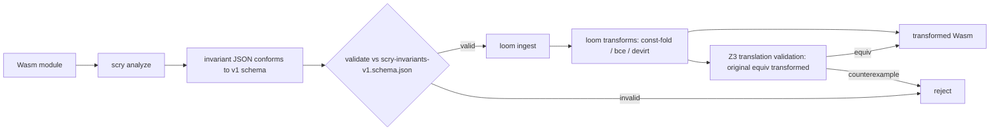

# scry invariant JSON-schema contract (v1)

This document specifies the stable, versioned JSON contract that scry publishes
for its `analyze()` output, so the loom optimizer (and the witness verifier) can
consume scry invariants without coupling to scry's WIT bindings.

- Schema file: `contracts/scry-invariants-v1.schema.json`
- Schema id / URI: `https://pulseengine.eu/scry-invariants/v1`
- JSON Schema dialect: draft 2020-12
- Realizes [[FEAT-008]]; satisfies [[REQ-004]]; decided in [[DD-007]].

The contract is the serialized form of the WIT `analysis-result`
(`crates/scry-analyzer/wit/scry.wit`). It introduces no new types — it is a
projection of the existing `invariant-bundle` / `call-graph` (list of
`call-edge`) / `function-summaries` (list of `function-summary`) structures onto
draft-2020-12 JSON Schema. The WIT remains the source of truth; this schema is
the wire contract loom validates against.

> Note on the document `type`: rivet's document schema names this document type
> `spec`. The FEAT-008 brief asked for a specification document; this repo's
> rivet schema spells that type `spec`.

## Why a JSON contract (and not the WIT)

scry already emits everything loom needs through the WIT `analysis-result`:
interval invariants ([[FEAT-001]]), region-pointers ([[FEAT-005]]), the sound
call graph ([[FEAT-006]]), and per-function compositional summaries (added at
v0.5, in the Stiévenart & De Roover summary style — [[AC-010]]). But making loom
link against scry's `wit-bindgen` output would couple the optimizer to scry's
component ABI and release cadence. Per [[DD-007]], the analysis output is
schema-stable and decoupled from the WIT: loom ingests a plain JSON document and
validates it against this versioned schema. This mirrors FEAT-002 / meld#192,
where the producer publishes the contract and the consumer side is a separate
cross-repo concern.

The `invariant-bundle.schema` field carries the URI above; v1 freezes the
field-by-field mapping below. Future incompatible changes get a new `/v2` id.

## WIT to JSON field mapping

WIT records map to JSON objects; WIT `kebab-case` field names are preserved
verbatim as JSON keys. The WIT `variant abstract-value` maps to a `kind`-tagged
union. Numeric widths are range-constrained in JSON (`u32`, `s64`).

| WIT type / field | JSON encoding |
| --- | --- |
| `analysis-result` | object `{ "invariants", "diagnostics"?, "call-graph", "function-summaries" }` |
| `analysis-result.invariants: invariant-bundle` | `"invariants"` — object |
| `analysis-result.diagnostics: list<diagnostic>` | `"diagnostics"` — array (optional; loom ignores it) |
| `analysis-result.call-graph: list<call-edge>` | `"call-graph"` — array |
| `analysis-result.function-summaries: list<function-summary>` | `"function-summaries"` — array |
| `invariant-bundle.schema: string` | `"schema"` — `const` = the v1 URI |
| `invariant-bundle.module-sha256: string` | `"module-sha256"` — `^[0-9a-f]{64}$` (lowercase hex) |
| `invariant-bundle.points: list<program-point>` | `"points"` — array |
| `program-point.func-index: u32` | `"func-index"` — integer `[0, 2^32-1]` |
| `program-point.pc: u32` | `"pc"` — integer `[0, 2^32-1]` |
| `program-point.locals: list<local-invariant>` | `"locals"` — array |
| `local-invariant.local-index: u32` | `"local-index"` — integer u32 |
| `local-invariant.value: abstract-value` | `"value"` — tagged union (below) |
| `interval.lo: s64`, `interval.hi: s64` | `{ "lo", "hi" }` — integers in s64 range, inclusive |
| `region-pointer-payload.region-id: u32` | `"region-id"` — integer u32 |
| `region-pointer-payload.offset: interval` | `"offset"` — interval object |
| `call-edge.caller-func: u32` | `"caller-func"` — integer u32 |
| `call-edge.pc: u32` | `"pc"` — integer u32 |
| `call-edge.indirect: bool` | `"indirect"` — boolean |
| `call-edge.resolved-targets: list<u32>` | `"resolved-targets"` — array of u32 |
| `call-edge.soundness: soundness-tag` | `"soundness"` — `"sound"` \| `"unsound-fallback"` |
| `function-summary.func-index: u32` | `"func-index"` — integer u32 |
| `function-summary.param-count: u32` | `"param-count"` — integer u32 |
| `function-summary.result-summary: list<abstract-value>` | `"result-summary"` — array of tagged unions |
| `function-summary.context-sensitive: bool` | `"context-sensitive"` — boolean |
| `function-summary.recursive: bool` | `"recursive"` — boolean |
| `diagnostic.severity: diagnostic-severity` | `"severity"` — `"info"` \| `"warning"` \| `"unsoundness-fallback"` |

### `abstract-value` variant -> `kind`-tagged union

The WIT `variant abstract-value` becomes a `oneOf` discriminated on `"kind"`:

| WIT case | JSON |
| --- | --- |
| `i32-interval(interval)` | `{ "kind": "i32-interval", "interval": { "lo", "hi" } }` |
| `i64-interval(interval)` | `{ "kind": "i64-interval", "interval": { "lo", "hi" } }` |
| `region-pointer(region-pointer-payload)` | `{ "kind": "region-pointer", "region": { "region-id", "offset" } }` |
| `unknown` | `{ "kind": "unknown" }` |

Every object in the contract is closed (`"additionalProperties": false`), so loom
gets a tight contract: unknown fields are a hard validation error rather than a
silently-ignored extension. The one deliberately optional field is top-level
`diagnostics`, which loom does not consume.

## Rationale: each invariant kind maps to the loom transform it unlocks

The contract exists to drive optimizer transforms. Each invariant kind maps to a
specific, sound loom rewrite (the substance of [[FEAT-008]]'s loom integration):

- Singleton interval (`lo == hi`) maps to constant-fold. When a local's
  `abstract-value` is `i32-interval`/`i64-interval` with `lo == hi`, the value is
  statically known. loom replaces uses of that local with the constant and folds
  dependent arithmetic. Provenance: the interval domain of [[FEAT-001]].

- In-region load (offset proven within `memory.size`) maps to bounds-check
  elision. When a load/store address is a `region-pointer` whose `offset`
  interval, plus the access width, is provably within the region's size, the
  access cannot trap. loom elides the dynamic bounds check. Provenance: the
  region-pointer domain of [[FEAT-005]].

- Singleton call-edge target set maps to devirtualize `call_indirect` to `call`.
  When a `call-edge` for a `call_indirect` site (`indirect == true`) has exactly
  one entry in `resolved-targets` and `soundness == "sound"`, the callee is
  uniquely determined. loom rewrites the indirect call into a direct call
  (enabling inlining). `unsound-fallback` edges are never devirtualized.
  Provenance: the sound call graph of [[FEAT-006]].

Each transform is sound only because the underlying analysis is sound; loom is
expected to discharge each rewrite with a Z3 translation-validation check (see
data flow below).

## scry to loom data flow



## Worked example: `fixture-01-constant-fold`

A function whose single integer local is narrowed to a singleton interval by the
final program point — the canonical input for the singleton-to-constant-fold
transform. The local at the last program point (`pc = 40`) is the constant `84`,
encoded as the singleton interval `{ "lo": 84, "hi": 84 }`.

```json
{
  "invariants": {
    "schema": "https://pulseengine.eu/scry-invariants/v1",
    "module-sha256": "e3b0c44298fc1c149afbf4c8996fb92427ae41e4649b934ca495991b7852b855",
    "points": [
      {
        "func-index": 0,
        "pc": 12,
        "locals": [
          { "local-index": 0, "value": { "kind": "i32-interval", "interval": { "lo": 0, "hi": 42 } } }
        ]
      },
      {
        "func-index": 0,
        "pc": 40,
        "locals": [
          { "local-index": 0, "value": { "kind": "i32-interval", "interval": { "lo": 84, "hi": 84 } } }
        ]
      }
    ]
  },
  "call-graph": [],
  "function-summaries": [
    {
      "func-index": 0,
      "param-count": 1,
      "result-summary": [ { "kind": "i32-interval", "interval": { "lo": 84, "hi": 84 } } ],
      "context-sensitive": true,
      "recursive": false
    }
  ]
}
```

At `pc = 40`, `locals[0]` has `lo == hi == 84`: loom may replace every use of
local 0 with the constant `84` and propagate. The function summary records the
same singleton as the result, so an interprocedural caller can const-fold the
call's result too.

## Validation status (honest constraint)

The contract is validated in CI by a native test
(`crates/scry-host-tests/tests/contract.rs`): it builds a representative
`analysis-result`-shaped value with plain serde structs (independent of the WIT
bindings — the point is that the JSON contract stands alone for loom), serializes
it with `serde_json`, and validates it against
`contracts/scry-invariants-v1.schema.json` using the `jsonschema` crate. The test
also asserts the three loom-transform shapes are expressible (a singleton
interval, a `region-pointer`, and a singleton sound `call-edge`) and that the
schema rejects malformed instances.

This is a hand-constructed value, not the output of a live `analyze()` call. The
abstract-side host harness in `crates/scry-host-tests/` is SKIPPED in CI because
`rules_wasm_component`'s `wac_compose` emits root-level component imports that
wasmtime 45 rejects (see the module-level doc in
`crates/scry-host-tests/tests/soundness.rs`). We therefore cannot drive a live
`analyze()` to JSON round-trip in CI yet. The v0.6.0 deliverable is the contract
plus its mechanical validation against a representative value; wiring a live
component round-trip is gated on the compose-toolchain fix. The loom-side
consumption of this contract is tracked as a separate cross-repo issue.
