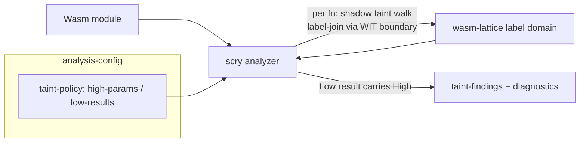

# scry taint / noninterference domain (v0.8)

This document specifies scry's security-label (taint) domain, the v0.8
deliverable of [[FEAT-009]] (the Wanilla-class noninterference analysis,
[[AC-007]]). The domain composes *with* the interval and region domains —
it does not replace them.

## The lattice

A two-point confidentiality lattice, the classic information-flow order:

```text
       high   (⊤ — secret; "may depend on a declared High source")
        |
       low    (⊥ — public; "provably carries no secret")
```

- `join` (⊔) = logical OR — the forward-taint rule: a value derived from
  two operands is secret iff either operand was.
- `meet` (⊓) = logical AND.
- `leq` (⊑) = the chain `low ⊑ high` (false only for `high ⊑ low`).

The algebra lives in the pure, dependency-free `crates/scry-taint` crate.
Because the lattice has height 1, every algebraic law is checked
**exhaustively** over its 2ⁿ input tuples. The `wasm-lattice` Wasm
component's WIT `label-*` exports (`label-bottom`/`label-top`/`label-leq`/
`label-join`/`label-meet`) delegate to that crate, so the shipped lattice
code is exactly the natively-falsified code ([[DD-008]] dogfood; the
reusable-domain story of [[FEAT-003]]).

## Policy: sources and sinks

The analysis is opt-in via `analysis-config.taint-policy`:

| Field | Meaning |
|---|---|
| `high-params` | parameter indices treated as **High** sources, applied at each analyzed function's entry |
| `low-results` | result indices required to remain **Low** at function exit |

An empty policy taints nothing and reports nothing — behaviour is exactly
as in v0.7.

## Propagation

A dedicated shadow-taint walk runs per function: a `security-label` per
operand-stack slot and per local, threaded alongside the interval/region
abstract value, plus a **control-context label** (`ctx`).

- **Explicit flows.** Constants push `low`; `local.get` pushes the local's
  label; arithmetic / bitwise / comparison / conversion operators push the
  join of their operands; `local.set` / `local.tee` store `join(value,
  ctx)`.
- **Implicit flows.** Unlike the interval pass (which scrubs to top on all
  control flow), the taint walk interprets *empty-typed* structured
  `if` / `else` / `block` / `end`: at an `if` the condition's label raises
  `ctx` for the dominated region, so an assignment inside a secret-guarded
  branch becomes High even when the assigned value is a constant. This is
  what makes the result a sound **termination-insensitive noninterference**
  analysis rather than mere explicit-flow taint.
- **Conservative fallback.** Any unmodelled operator — `loop` (needs a
  taint fixpoint), `br*`, value-typed blocks, `call*`, memory and global
  ops — raises the whole taint state to High (the sound top) and stops
  precise tracking. Raising can only *add* taint, so a flow is never
  missed.

## Findings

At function exit the result labels are the top of the value stack. For
each `low-results` index whose label is High, scry emits a `taint-finding`
(`func-index`, `pc`, `kind`, `source-label`, `sink-label`, `message`) and
a `Warning` diagnostic. `kind` distinguishes `high-result-explicit` from
`high-result-implicit`. Findings are surfaced on the additive
`analysis-result.taint-findings` field and the matching `taint-findings`
block of the v1 invariant contract (see `docs/invariant-schema-v1.md`).

## scry ⇄ taint data flow



## Soundness and the falsifiable kill-criterion

Soundness ([[REQ-001]], [[AC-007]]): `high` is the sound top, `join`
never moves down the lattice, and every unmodelled construct raises to
High — so forward propagation can only *over*-approximate secret
dependence. Therefore a result proven `low` is independent of every
declared High source, and **the absence of a finding implies
noninterference** (under termination-insensitive assumptions). False
alarms are possible; missed real flows are not.

Kill-criterion: the label lattice obeys its algebraic laws **and** `join`
is an upper bound with `high` absorbing. Falsified exhaustively in
`crates/scry-taint` (12 tests) and `crates/scry-host-tests/tests/taint.rs`
(6 tests); the `taint-finding` contract shape is pinned in
`crates/scry-host-tests/tests/contract.rs`.

## Deferred (a later FEAT-009 slice)

Tainted store/load tracking through linear memory (memory as a sink),
multi-principal / lattice-of-sets labels, value-sensitive declassification,
unstructured-control implicit flows (`loop` taint fixpoint, `br_table`
post-dominator analysis), and the Wanilla shared-benchmark differential
corpus (FEAT-009 AC#2). As with [[FEAT-008]], the live `analyze()`
round-trip stays gated by the wac_compose / wasmtime-45 root-import
limitation, so the lattice and finding shapes are falsified natively
rather than via a live component call.
